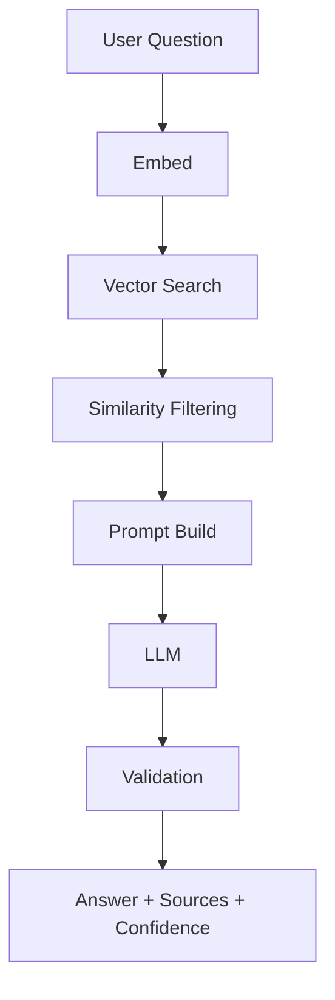

 # 🧠SaaS Support Copilot (RAG-Based AI)

A production-ready Retrieval-Augmented Generation (RAG) backend that answers SaaS support questions using internal documentation only.
The system prevents hallucinations, provides source attribution, and includes confidence scoring.

## 🚀Key Features :-

* Retrieval-Augmented Generation (RAG)
* Vector search using ChromaDB
* LLM responses via Groq Cloud
* Source attribution for grounded answers
* Confidence scoring based on similarity
* Hallucination-safe refusal logic
* Admin-protected document ingestion

## 🧩Tech Stack :-

* FastAPI – Backend API
* ChromaDB – Vector database
* Sentence Transformers – Embeddings
* Groq Cloud – LLM inference
* Python 3.11+

## 🏗️Core Workflow :-

## 🧪API testing
## Use Swagger UI at:
http://127.0.0.1:8000/docs

## Test:

POST /auth/signup

POST /auth/login

POST /rag/ingest (Admin only)

POST /rag/ask

## 🧪API Endpoints :-

 ### Ingest Documents (Admin Only):-

    POST /rag/ingest
    Header: x-admin-key

### Ask Question
    POST /rag/ask

    Request:
    {
    "question": "How does the billing cycle work?",
    "top_k": 5
    }

    Response:
    {
    "answer": "...",
    "sources": [...],
    "status": "ok",
    "confidence": "high_confidence"
    }

# ⚙️Environment Variables :-
    GROQ_API_KEY=your_groq_api_key
    ADMIN_API_KEY=your_admin_api_key

 ## ▶️ How to run Backend (FastAPI)
Follow the steps below from the project root directory.

1️⃣ Create Virtual Environment (First Time Only)

    python -m venv .venv

2️⃣ Activate Virtual Environment

    .\.venv\Scripts\Activate.ps1

You should see (.venv) in your terminal prompt.

3️⃣ Install Dependencies (First Time / Updates)

    pip install -r backend/requirements.txt

4️⃣ Start Backend Server (Recommended)

    .\.venv\Scripts\Activate.ps1
    cd backend
    uvicorn app.main:app --reload --env-file .env

## ✅ Backend Verification
    Once running, confirm the server is up:
    API Docs: http://127.0.0.1:8000/docs
    Health Check: http://127.0.0.1:8000/health

# 🎨 Frontend Setup (React + Vite)
## 1️⃣ Create React + Vite App

npm create vite@latest frontend -- --template react
cd frontend
npm install

## 2️⃣ Run Frontend Dev Server

cd frontend
npm run dev

## 🎯 Tailwind CSS Setup

npm install -D tailwindcss@3.4.17 postcss autoprefixer
npx tailwindcss@3.4.17 init -p

## 🧱 shadcn/ui Setup

npx shadcn@latest init

## Install commonly used components:

npx shadcn@latest add button

npx shadcn@latest add badge

npx shadcn@latest add card

npx shadcn@latest add input

npx shadcn@latest add seprator

npx shadcn@latest add textare

# ✅ Summary

Backend: FastAPI + RAG (secure, grounded, production-ready)

Frontend: React + Vite with Tailwind & shadcn/ui

Clean separation of concerns